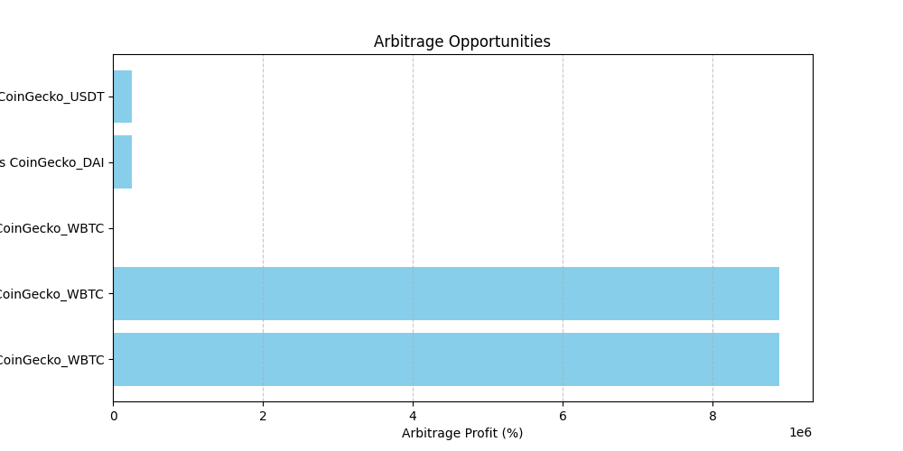
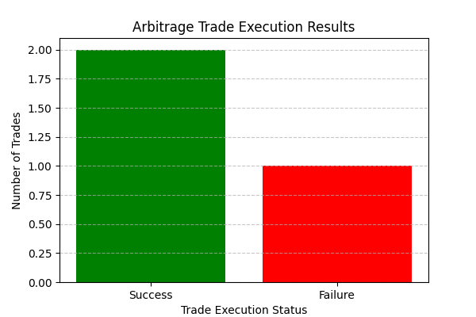
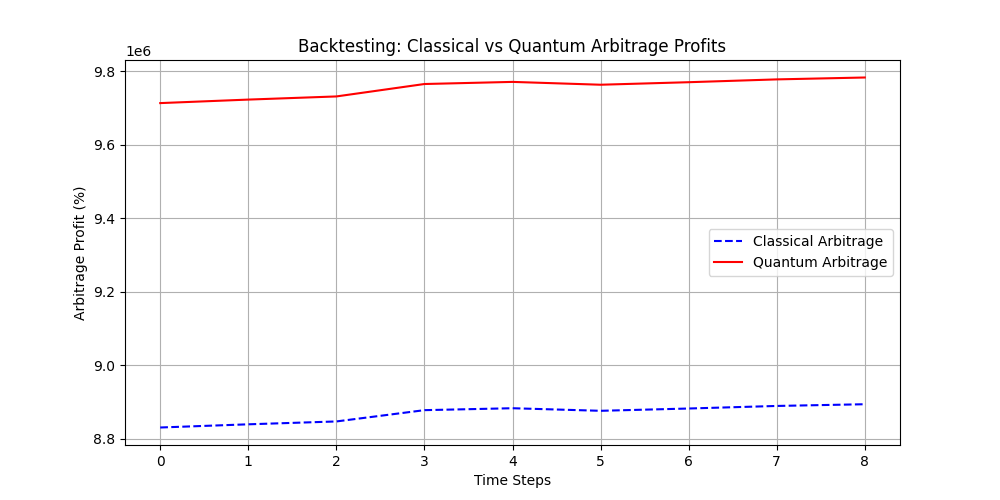
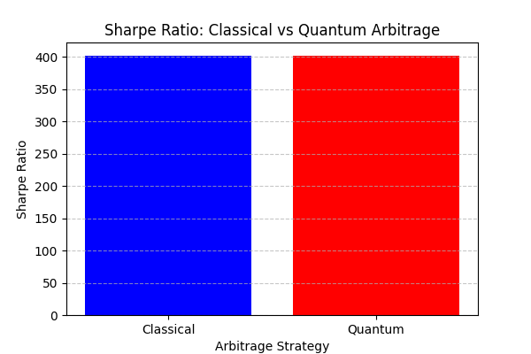
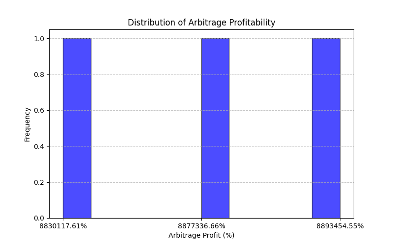
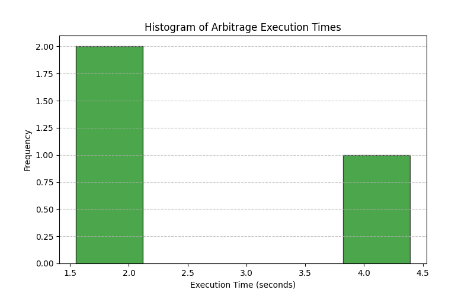

# Quantum-Driven Arbitrage Strategies in Decentralized Finance (DeFi)

## 📌 Overview
This project leverages **quantum computing and classical methods** to optimize arbitrage trading strategies in **Decentralized Finance (DeFi)**. It automates data collection, quantum optimization, trade execution, backtesting, and result analysis.

## 📂 Project Structure

```
# Quantum DeFi Arbitrage

## 📂 Project Structure
```

## Description of Key Components

### `data/`
- **`raw/`**: Contains raw price data fetched from DeFi platforms.
- **`processed/`**: Stores processed data after optimization for arbitrage trades.

### `models/`
- Contains trained quantum and classical models used for optimization.

### `results/`
- **`logs/`**: Logs of arbitrage trades and backtesting results.
- **`plots/`**: Visualizations of analysis and results.
- **`reports/`**: Final reports summarizing findings and performance.

### `src/`
- **`data_pipeline.py`**: Fetches real-time token prices from DeFi platforms.
- **`quantum_optimization.py`**: Implements quantum and classical optimization algorithms.
- **`arbitrage_execution.py`**: Executes optimized trades on supported platforms.
- **`backtesting.py`**: Backtests the performance of quantum vs. classical models.
- **`results_analysis.py`**: Analyzes and visualizes results for insights.
- **`deploy_contract.py`**: (Optional) Deploys smart contracts for trade execution.
- **`generate_report.py`**: Generates a PDF report summarizing results.
- **`config.py`**: Stores API keys, contract addresses, and other configurations.
- **`config.json`**: Configuration file for API keys and parameters.

## ⚙️ Setup Instructions

### **1️⃣ Create Virtual Environment**
```
python3 -m venv venv
source venv/bin/activate  # Mac/Linux
venv\Scripts\activate     # Windows
```

### **2️⃣ Install Dependencies**
```
pip install -r requirements.txt
```

### **3️⃣ Add API Keys to `config.json`**
Replace placeholders in `config.json`:
```json
{
  "API_KEYS": {
    "infura": "YOUR_INFURA_API_KEY",
    "alchemy": "YOUR_ALCHEMY_API_KEY",
    "etherscan": "YOUR_ETHERSCAN_API_KEY",
    "coingecko": "YOUR_COINGECKO_API_KEY"
  },
  "CONTRACT_ADDRESS": "",
  "PARAMETERS": {
    "network": "ethereum",
    "slippage_tolerance": 0.01,
    "gas_limit": 250000
  }
}
```

## 🚀 Running the Full Pipeline

### **1️⃣ Run Data Pipeline (in a separate terminal)**
```
python src/data_pipeline.py
```
- **Fetches live token prices**
- Stores in `data/raw/token_prices.csv`
- Updates every 60 seconds

### **2️⃣ Run Optimization & Execution**
```
python src/quantum_optimization.py && \
python src/arbitrage_execution.py && \
python src/backtesting.py && \
python src/results_analysis.py && \
python src/generate_report.py
```
✅ **Optimizes arbitrage trades**  
✅ **Executes trades**  
✅ **Backtests performance**  
✅ **Generates plots & final report**

## 📊 Generated Outputs

### **🔹 Data Files**
| File | Description |
|------|------------|
| [`data/raw/token_prices.csv`](data/raw/token_prices.csv) | Raw market prices |
| [`data/processed/optimized_arbitrage.csv`](data/processed/optimized_arbitrage.csv) | Optimized trade signals |

### **🔹 Logs**
| File | Description |
|------|------------|
| [`results/logs/arbitrage_trades.csv`](results/logs/arbitrage_trades.csv) | Executed trade logs |
| [`results/logs/backtesting_results.csv`](results/logs/backtesting_results.csv) | Historical backtesting results |


### 📊 Visualizations

#### **Arbitrage Opportunities**


#### **Execution Time**


#### **Backtesting Profit Comparison**


#### **Backtesting Sharpe Ratio**


#### **Profitability Distribution**


#### **Execution Time Histogram**



### **🔹 Reports**
| File | Description |
|------|------------|
| [`results/reports/arbitrage_report.pdf`](results/reports/arbitrage_report.pdf) | Contains trade results, performance metrics, and visualizations |


## 📜 Smart Contract Deployment (Optional)
To deploy the smart contract, first export your **private key**:
```
export PRIVATE_KEY="your_private_key"
export ACCOUNT_ADDRESS="your_ethereum_wallet"
```
Then, run:
```
python src/deploy_contract.py
```
⚠️ **Gas fees apply. Ensure you have enough ETH.**

## 🔗 Contributing
- Feel free to improve this project! Fork, modify, and send a PR.

## 📬 Contact
For questions, reach out to:  
📧 **gummadikarthikeya3@gmail.com**  
💼 **[LinkedIn](https://linkedin.com/in/karthikeya9296)**

**🚀 Happy Trading!** 🔥💰